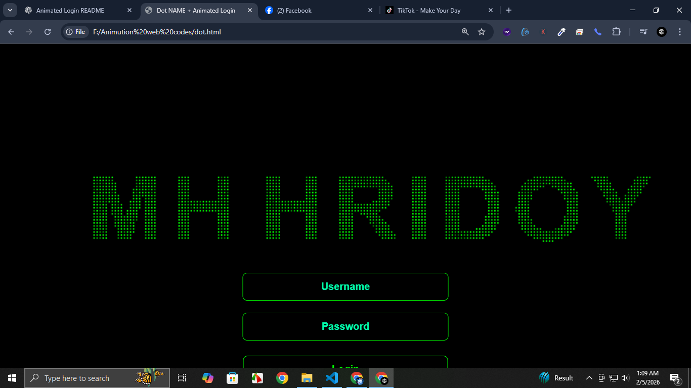

# Dot NAME + Animated Login

An interactive and visually appealing **dot animation login page** created using HTML, CSS, and JavaScript. Click anywhere on the canvas to form the animated letters of the name **"MH HRIDOY"** and reveal a stylish login form.

<!-- Images -->



---

## Features

- **Dot Animation:** Thousands of green dots float randomly on the screen.
- **Interactive Text Formation:** Clicking the canvas makes the dots arrange to form a custom name.
- **Animated Login Form:** Smooth fade-in and slide-down effect for the login form.
- **Responsive Design:** Works on all screen sizes.
- **Simple Authentication:** Check credentials using a basic JavaScript function.

---

## Demo

Click anywhere on the canvas to see the animation in action and the login form appear.

---

## Getting Started

### Prerequisites

- Modern web browser (Chrome, Firefox, Edge, Safari)
- No server needed — works locally

### Installation

1. Clone this repository:

```bash
git clone https://github.com/your-username/dot-name-login.git
